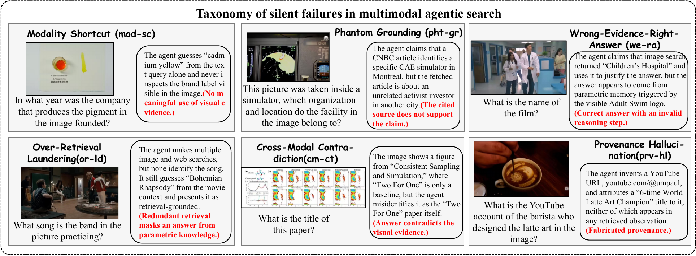
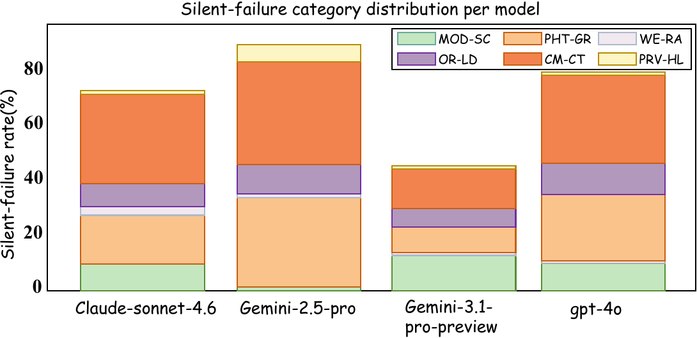

# Silent Failures in Multimodal Agentic Search
### A Diagnostic Taxonomy and Cross-Judge Evaluation

[](https://arxiv.org/abs/XXXX.XXXXX)
[](https://huggingface.co/datasets/USERNAME/DATASET_NAME)
[](https://www.youtube.com/watch?v=rsu2zykZ3Lk)
[](https://www.python.org/)
[](LICENSE)

*A diagnostic framework for detecting when multimodal search agents look correct but are not faithfully grounded in the image, retrieved evidence, or trajectory.*

### Accepted as an Oral Presentation at SIGIR 2026 SynthIR Workshop

> Thank you for submitting your paper to the SIGIR 2026 SynthIR Workshop.



Main figure from the paper: a six-category taxonomy of silent failures in multimodal agentic search.

---

## Table of Contents

- [Overview](#overview)
- [Highlights](#highlights)
- [Silent-Failure Taxonomy](#silent-failure-taxonomy)
- [Diagnostic Pipeline](#diagnostic-pipeline)
- [Results](#results)
- [Figures and Video](#figures-and-video)
- [Repository Structure](#repository-structure)
- [Installation](#installation)
- [Data Preparation](#data-preparation)
- [Running the Pipeline](#running-the-pipeline)
- [Notes](#notes)
- [License](#license)

---

## Overview

Multimodal agentic search systems are commonly evaluated by final-answer accuracy. That score can be misleading: an agent may output a plausible answer while ignoring the image, citing evidence that does not support its claim, contradicting visible content, or presenting parametric knowledge as retrieval-grounded reasoning.

This project studies those **silent failures** in multimodal agentic search. We run three frontier multimodal models under the same ReAct-style search scaffold, record full trajectories, label each trajectory with a structured LLM-judge rubric, and compare answer accuracy with **true correctness rate (TCR)**.

The release includes the diagnostic code. The data package, trajectories, labels, and result artifacts are intended to be hosted separately on Hugging Face.

---

## Highlights

- **Six-category taxonomy** for silent failures in multimodal agentic search.
- **Trajectory-level diagnosis** using full ReAct logs rather than final answers only.
- **Cross-judge validation** with same-family and cross-family LLM judges.
- **Blank-image stress test** to check whether correct answers survive image removal.
- **Tool ablation** showing that reverse-image-search improves accuracy but reshapes the failure surface.

---

## Silent-Failure Taxonomy

| Category | Short name | What it captures |
|:--|:--:|:--|
| Modality Shortcut | `MOD-SC` | The answer is reached without meaningful use of the image. |
| Phantom Grounding | `PHT-GR` | The cited source does not support the claimed evidence. |
| Wrong-Evidence-Right-Answer | `WE-RA` | The final answer is correct, but the reasoning path is invalid. |
| Over-Retrieval Laundering | `OR-LD` | Many retrieval calls are used to decorate an answer that appears parametric. |
| Cross-Modal Contradiction | `CM-CT` | The answer follows text retrieval but contradicts the image. |
| Provenance Hallucination | `PRV-HL` | URLs, dates, sources, or provenance details are invented. |

---

## Diagnostic Pipeline

Each `(task, model)` pair produces one structured trajectory. The primary judge receives the original task, input image, ground-truth answer, and full trajectory, then returns answer correctness plus six category-level labels.

---

## Results

### Accuracy vs. True Correctness

| Model | N | Accuracy | TCR | Silent failure among correct |
|:--|--:|--:|--:|--:|
| Claude Sonnet 4.6 | 200 | 25.0 | 24.0 | 4.0% |
| Gemini 2.5 Pro | 200 | 21.5 | 19.0 | 11.6% |
| GPT-4o | 200 | 20.0 | 19.5 | 2.5% |

### Committed-Subset Failure Distribution

| Model | `MOD-SC` | `PHT-GR` | `WE-RA` | `OR-LD` | `CM-CT` | `PRV-HL` |
|:--|--:|--:|--:|--:|--:|--:|
| Claude Sonnet 4.6 | 5.1 | 21.3 | 0.7 | 10.3 | 30.9 | 0.7 |
| Gemini 2.5 Pro | 0.8 | 33.8 | 1.5 | 13.5 | 38.3 | 4.5 |
| GPT-4o | 7.4 | 27.4 | 0.0 | 9.1 | 37.1 | 0.6 |



Silent-failure rates per category on the committed subset. A single trajectory can contribute to multiple categories.

### Key Findings

- **TCR is lower than surface accuracy** across all three evaluated models.
- **Blank-image survival is 0/133**: no originally correct trajectory remains correct after replacing the image with a blank image.
- **Answer-correctness judge agreement is strong**: Cohen's kappa is 0.916 within the Claude family and 0.817 across Claude/GPT-4o.
- **Category-level judge agreement is weaker**, especially across model families.
- **Reverse-image-search improves committed accuracy by 13.9 to 18.9 points**, while shifting failures toward phantom grounding and cross-modal contradiction.

---

## Figures and Video

| Artifact | Link |
|:--|:--|
| Paper | [arXiv placeholder](https://arxiv.org/abs/XXXX.XXXXX) |
| Dataset | [Hugging Face placeholder](https://huggingface.co/datasets/USERNAME/DATASET_NAME) |
| Main figure | [assets/main_figure.png](assets/main_figure.png) |
| Result figure | [assets/fig2.png](assets/fig2.png) |
| Pipeline figure | [assets/pipeline.png](assets/pipeline.png) |
| Oral video | [YouTube](https://www.youtube.com/watch?v=rsu2zykZ3Lk) |

---

## Repository Structure

```text
.
├── code/
│   ├── agents/
│   │   ├── llm_client.py        # MatrixLLM-compatible model client
│   │   ├── react_agent.py       # ReAct loop and trajectory logging
│   │   └── tools.py             # Search, fetch, image, and crop tools
│   ├── judges/
│   │   ├── rubric.md            # Silent-failure rubric
│   │   └── run_judge.py         # Per-trajectory judge runner
│   ├── analysis/
│   │   ├── compute_metrics.py   # Accuracy, TCR, SFR, agreement, figures
│   │   ├── analyze_shortcut.py  # Blank-image stress-test analysis
│   │   └── v1_vs_v2.py          # Reverse-image-search ablation
│   ├── run_agents.py            # Main model rollout script
│   ├── run_judge_all.py         # Batch judging script
│   └── smoke_test.py            # Endpoint and one-step agent sanity check
├── requirements.txt
└── .env.example
```

---

## Installation

> Tested with Python 3.10+.

```bash
python3 -m venv .venv
source .venv/bin/activate
pip install -r requirements.txt
cp .env.example .env
```

Fill in `.env` with your own keys:

```bash
MATRIXLLM_API_KEY=
SERPAPI_KEY=
TAVILY_API_KEY=
GOOGLE_API_KEY=
GOOGLE_CSE_ID=
```

---

## Data Preparation

Download or place the Hugging Face data package at the repository root:

```text
data/
  raw/
    mmsearch_plus_sample.jsonl
    images/
  trajectories/
  trajectories_blank/
  annotations/
results/
```

The prepared Hugging Face package contains 200 sampled MMSearch-Plus tasks, 600 model trajectories, judge labels, blank-image stress-test outputs, v1/v2 ablation artifacts, and final result tables.

---

## Running the Pipeline

### 1. Smoke test

```bash
python code/smoke_test.py
```

### 2. Generate trajectories

```bash
python code/run_agents.py
```

### 3. Run the primary judge

```bash
python code/run_judge_all.py
```

### 4. Recompute tables and figures

```bash
python code/analysis/compute_metrics.py
python code/analysis/analyze_shortcut.py
python code/analysis/v1_vs_v2.py
```

---

## Notes

- Do not commit a filled `.env` file.
- The `.env.example` file uses placeholders only.
- The GitHub repository should contain code; larger trajectories, annotations, images, and result artifacts should live in the Hugging Face dataset repository.
- Before public release, confirm the redistribution terms for MMSearch-Plus-derived images and tasks.

---

## License

License is currently TBD. Code and data may need separate licenses because the data package includes MMSearch-Plus-derived content.
